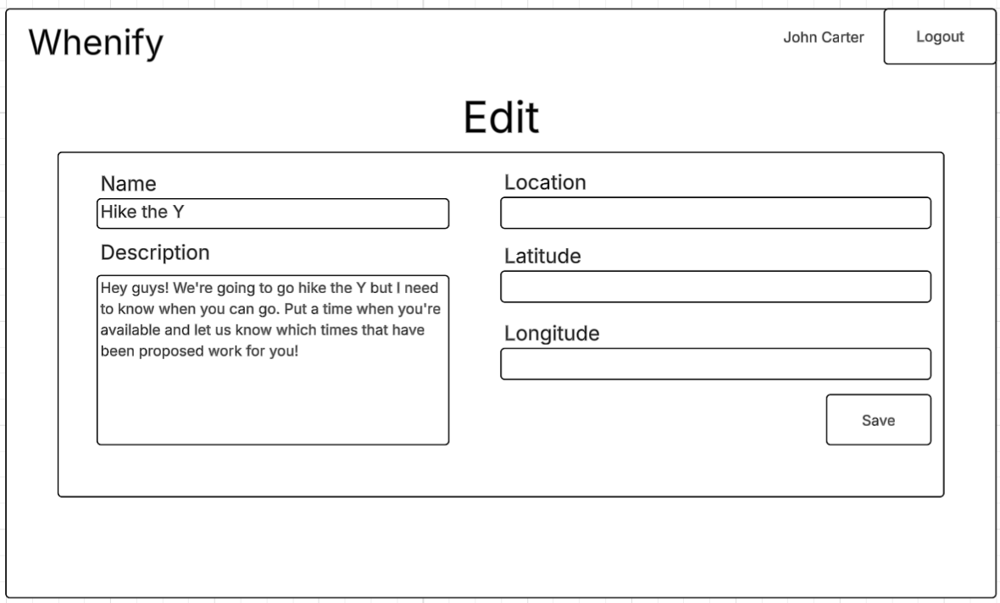
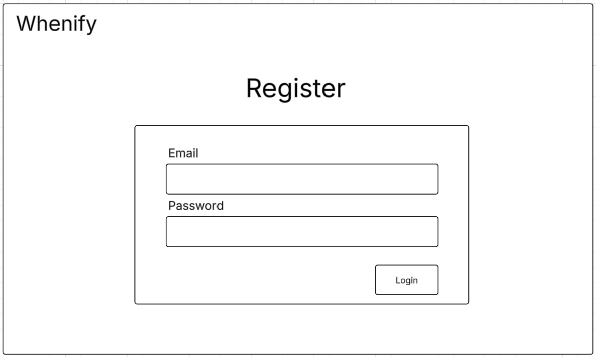
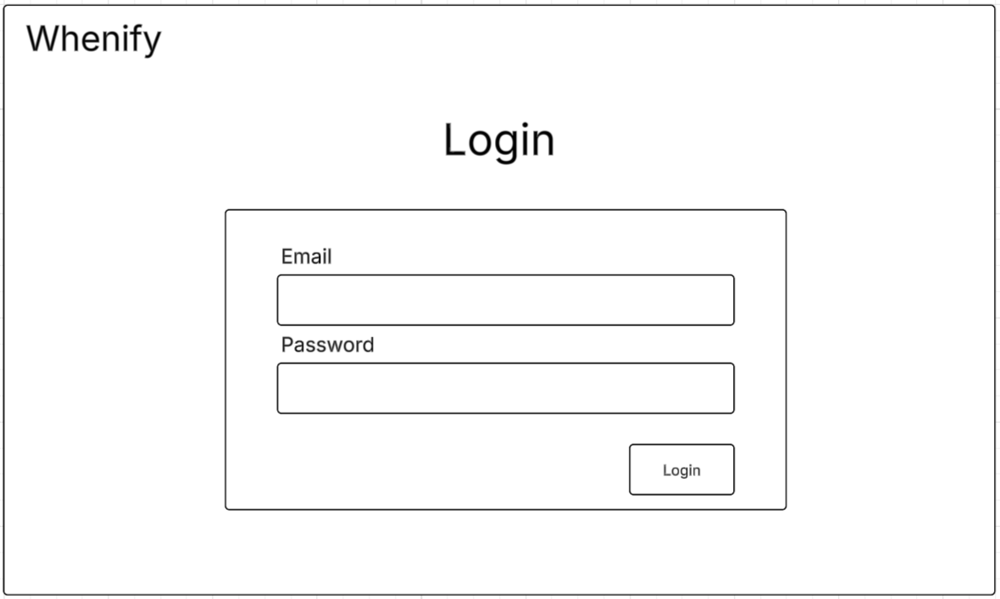

# Whenify

[My Notes](notes.md)

## 🚀 Specification Deliverable

For this deliverable I did the following. I checked the box `[x]` and added a description for things I completed.

- [X] Proper use of Markdown
- [X] A concise and compelling elevator pitch
- [X] Description of key features
- [X] Description of how you will use each technology
- [X] One or more rough sketches of your application. Images must be embedded in this file using Markdown image references.

### Elevator pitch

Each of us have, at one point or another, been trying to schedule a time to get something done with others. Maybe you and your friends want to get together for lunch, or maybe you and some colleagues need to meet to collaborate on a project. Everytime you say "well, there's only a few of us, so finding a time should be easy!" But, as you are well aware, it rarely is easy. Introducing Whenify, the easy, collaborative solution to win scheduling! Whenify allows you and your group to easily input when each of you are available and helps choose the best time for the group. If your event is outside, it will even help you plan around the weather!

### Design

The layout to enter in your availability and indicate your availability for other's proposals

The layout to edit the whenify (must be an authorized user)

The registration page

The login page

### Key features

- Enter in your availability, signed with your name
- See who has put in their availability
- Indicate which options work for you
- See likely likely weather based off of live weather data for the event's location
- See votes for times in real time

### Technologies

I am going to use the required technologies in the following ways.

- **HTML** - Layout Whenify, providing the structure of the website. The most complicated components will be the times as they will need to handle websocket connection and will be very dynamic.
- **CSS** - CSS will be used for general styling.
- **React** - React forms the basis of how the content is actually delivered. All of the times will be their own components, which will have a lot of dynamic content that will have to be gnerated and updated. React will allow me to template these out and reuse them.
- **Service** - The backend has the or uses the following endpoints
  * Get weather data based off the logitude and latitude of the event using the open meteo api
  * Submit results for a Whenify user
  * Get, tablulate, and store the results of a Whenify in real time
- **DB** - The database stores entries for each Whenify (including the name of the event, who created it, and location), as well as the avaialbilities of each person that fills out the Whenify.
- **WebSocket** - Websocket is used to provide real time vote information and populating the list of proposed times as they are proposed.

## 🚀 AWS deliverable

For this deliverable I did the following. I checked the box `[x]` and added a description for things I completed.

- [X] **Server deployed and accessible with custom domain name** - [My server link](https://garrettwebster.click/).

## 🚀 HTML deliverable

For this deliverable I did the following. I checked the box `[x]` and added a description for things I completed.

- [X] **HTML pages** - Created the four pages that are needed
- [X] **Proper HTML element usage** - Used appropriate tags, such as nav, main, and footer.
- [X] **Links** - The header (not currently styled as such because it is an a tag) on each page links to the main page. Includes a link from the main page to the edit page.
- [X] **Text** - Placeholder values used for values in the times, votes, description, etc. There is very, very minimal text that will not be populated from user data.
- [X] **3rd party API placeholder** - The weather icons are determined based on info gotten from a 3rd party weather data api.
- [X] **Images** - Weather icons showing what the expected weather is for that time and date.
- [X] **Login placeholder** - A form that allows a user to login. The name of the logged in user is displayed in the nav, as well as a logout button
- [X] **DB data placeholder** - In addition to registration and authentication information, all of the time and date, vote, and description data is stored in the database. Place-holder data for all of these have been added.
- [X] **WebSocket placeholder** - New proposed times and votes are populated from websocket. The new time input sends via websocket.

## 🚀 CSS deliverable

For this deliverable I did the following. I checked the box `[x]` and added a description for things I completed.

- [x] I completed the prerequisites for this deliverable (Simon deployed, GitHub link, Git commits)
- [x] **Visually appealing colors and layout. No overflowing elements.** - I'm definitely not a UI designer, but I'm pretty happy with how the layout itself turned out!
- [x] **Use of a CSS framework** - Using bootstrap, especially for the nav bar.
- [x] **All visual elements styled using CSS** - Yep!
- [x] **Responsive to window resizing using flexbox and/or grid display** - Looks great on different window sizes and devices, on the main page it changes the display of the main content to stack if the screen gets too small.
- [x] **Use of a imported font** - Knewave for the logo in the header
- [x] **Use of different types of selectors including element, class, ID, and pseudo selectors** - Yes, in various ways.

## 🚀 React part 1: Routing deliverable

For this deliverable I did the following. I checked the box `[x]` and added a description for things I completed.

- [ ] **Bundled using Vite** - I did not complete this part of the deliverable.
- [ ] **Components** - I did not complete this part of the deliverable.
- [ ] **Router** - I did not complete this part of the deliverable.

## 🚀 React part 2: Reactivity deliverable

For this deliverable I did the following. I checked the box `[x]` and added a description for things I completed.

- [ ] **All functionality implemented or mocked out** - I did not complete this part of the deliverable.
- [ ] **Hooks** - I did not complete this part of the deliverable.

## 🚀 Service deliverable

For this deliverable I did the following. I checked the box `[x]` and added a description for things I completed.

- [ ] **Node.js/Express HTTP service** - I did not complete this part of the deliverable.
- [ ] **Static middleware for frontend** - I did not complete this part of the deliverable.
- [ ] **Calls to third party endpoints** - I did not complete this part of the deliverable.
- [ ] **Backend service endpoints** - I did not complete this part of the deliverable.
- [ ] **Frontend calls service endpoints** - I did not complete this part of the deliverable.
- [ ] **Supports registration, login, logout, and restricted endpoint** - I did not complete this part of the deliverable.

## 🚀 DB deliverable

For this deliverable I did the following. I checked the box `[x]` and added a description for things I completed.

- [ ] **Stores data in MongoDB** - I did not complete this part of the deliverable.
- [ ] **Stores credentials in MongoDB** - I did not complete this part of the deliverable.

## 🚀 WebSocket deliverable

For this deliverable I did the following. I checked the box `[x]` and added a description for things I completed.

- [ ] **Backend listens for WebSocket connection** - I did not complete this part of the deliverable.
- [ ] **Frontend makes WebSocket connection** - I did not complete this part of the deliverable.
- [ ] **Data sent over WebSocket connection** - I did not complete this part of the deliverable.
- [ ] **WebSocket data displayed** - I did not complete this part of the deliverable.
- [ ] **Application is fully functional** - I did not complete this part of the deliverable.
